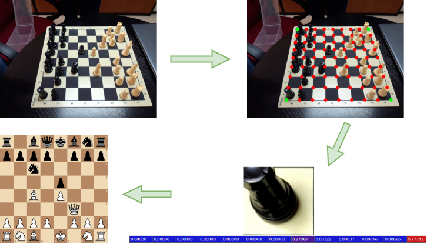
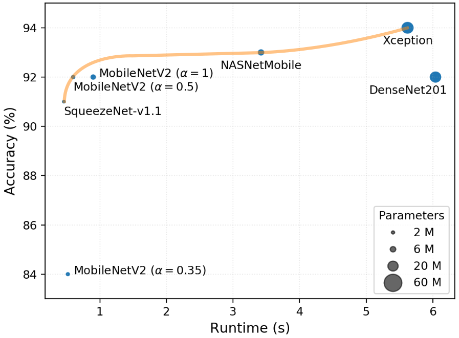
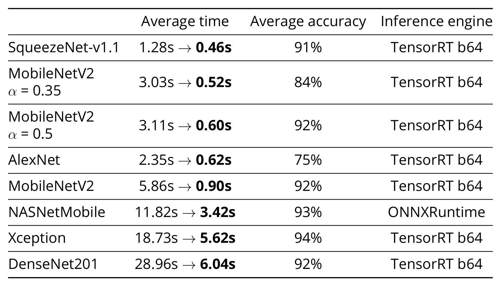
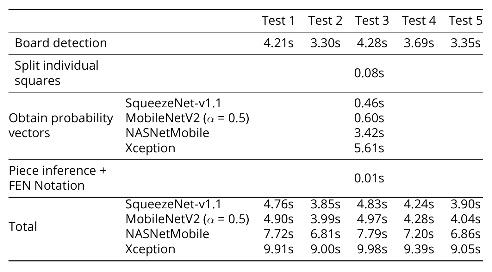
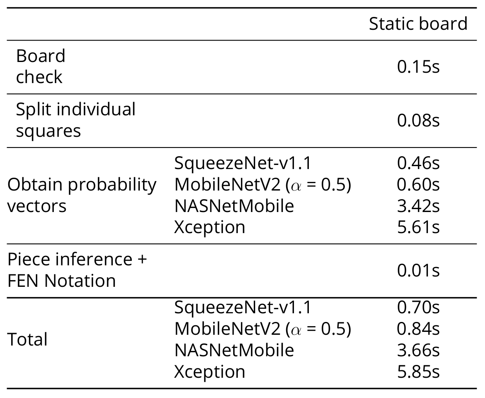

# LiveChess2FEN

LiveChess2FEN is a fully functional framework that automatically digitizes
the configuration of a chessboard. It is optimized for execution on a
Nvidia Jetson Nano.

This repository contains the code used in our [paper](https://arxiv.org/abs/2012.06858). If you find this useful, please consider citing us.
~~~
@article{mallasen2020LiveChess2FEN,
  title = {LiveChess2FEN: A Framework for Classifying Chess Pieces Based on CNNs},
  author = {Mallas{\'e}n Quintana, David and Del Barrio Garc{\'i}a, Alberto Antonio and Prieto Mat{\'i}as, Manuel},
  year = {2020},
  month = dec,
  journal = {arXiv:2012.06858 [cs]},
  eprint = {2012.06858},
  eprinttype = {arxiv},
  url = {http://arxiv.org/abs/2012.06858},
  archiveprefix = {arXiv}
}
~~~

## Benchmarks

The following times are measured on the Nvidia Jetson Nano 4GB. Each time value
is given per chessboard.

#### Piece classification times

#### Full digitization times

#### Static digitization times

_See `lc2fen/detectboard/laps.py -> check_board_position()`_

## Jetson Nano 2GB install

Instructions for the JetPack 4.6. If you run into any problems see the Troubleshooting section below.

1. From the [Jetson Zoo](https://elinux.org/Jetson_Zoo) install:
    1. Tensorflow
        ~~~
        sudo apt-get install libhdf5-serial-dev hdf5-tools libhdf5-dev zlib1g-dev zip libjpeg8-dev liblapack-dev libblas-dev gfortran
        sudo apt-get install python3-pip
        sudo pip3 install -U pip testresources setuptools==49.6.0
        sudo pip3 install -U numpy==1.19.4 future==0.18.2 mock==3.0.5 h5py==2.10.0 keras_preprocessing==1.1.1 keras_applications==1.0.8 gast==0.2.2 futures protobuf pybind11
        sudo pip3 install --pre --extra-index-url https://developer.download.nvidia.com/compute/redist/jp/v46 tensorflow
        ~~~
        
    2. ONNX Runtime
        Download the .whl file from [here](https://nvidia.box.com/s/bfs688apyvor4eo8sf3y1oqtnarwafww) and run:
        ~~~
        pip3 install onnxruntime_gpu-1.8.0-cp36-cp36m-linux_aarch64.whl
        ~~~

2. Install OpenCV 4.5 with CUDA enabled. To do so, download and execute the script found [here](https://github.com/AastaNV/JEP/blob/b5209e3edfad0f3f6b33e0cbc7e15ca3a49701cf/script/install_opencv4.5.0_Jetson.sh). Warning, this process will take a few hours and you will need at least 4GB of swap space.

3. Install [onnx-tensorrt](https://github.com/onnx/onnx-tensorrt/).
    ~~~
    git clone --recursive https://github.com/onnx/onnx-tensorrt.git
    cd onnx-tensorrt
    git checkout 8.0-GA
    mkdir build && cd build
    cmake .. -DCUDA_INCLUDE_DIRS=/usr/local/cuda/include -DTENSORRT_ROOT=/usr/src/tensorrt -DGPU_ARCHS="53"
    make
    sudo make install
    export LD_LIBRARY_PATH=$PWD:$LD_LIBRARY_PATH
    ~~~

### Utilities

- [jtop](https://github.com/rbonghi/jetson_stats) helps to monitor the usage of the Jetson Nano. To install:
    ~~~
    sudo -H pip install -U jetson-stats
    ~~~
    Then reboot the Jetson Nano. You can execute it by running `jtop`.

### Troubleshooting

- To upgrade CMake download [CMake 3.14.7](https://cmake.org/files/v3.14/cmake-3.14.7.tar.gz) and run:
    ~~~
    tar -zxvf cmake-3.14.7.tar.gz
    cd cmake-3.14.7
    sudo apt-get install libcurl4-openssl-dev
    sudo ./bootstrap
    sudo make
    sudo make install
    cmake --version
    ~~~

- To install [protobuf](https://github.com/protocolbuffers/protobuf/blob/master/src/README.md) download [protobuf 3.17.3](https://github.com/protocolbuffers/protobuf/releases/download/v3.17.3/protobuf-cpp-3.17.3.tar.gz) and run:
    ~~~
    tar -zxvf protobuf-cpp-3.17.3.tar.gz
    cd protobuf-3.17.3
    ./configure
    make
    sudo make install
    sudo ldconfig
    ~~~

- If you get the error message: `ImportError: /usr/lib/aarch64-linux-gnu/libgomp.so.1: cannot allocate memory in static TLS block` simply run:
    ~~~
    export LD_PRELOAD=/usr/lib/aarch64-linux-gnu/libgomp.so.1
    ~~~
    In order to solve permanently the error, add that line to the end of your `~/.bashrc` file.

- If you get the error `Illegal instruction (core dumped)` run:
    ~~~
    export OPENBLAS_CORETYPE=ARMV8
    ~~~
    In order to solve permanently the error, add that line to the end of your `~/.bashrc` file.

- If you get the error `error: command 'aarch64-linux-gnu-gcc' failed with exit status 1` run:
    ~~~
    sudo apt-get install python3-dev
    ~~~

## Setup

Note: You can find a list of version numbers for the python packages that have been tested to work in the `requirements.txt` file.

1. Install Python 3.6.9 or later and the following dependencies:
    - NumPy
    - OpenCV4
    - Matplotlib
    - scikit-learn
    - pillow
    - pyclipper
    - tqdm

2. Depending on the inference engine install the following dependencies:
    - Keras with tensorflow backend. Slower than ONNX.
    - ONNX Runtime.
    - (Optional) TensorRT and PyCUDA. Fastest available, although more tricky to set up.

3. Create a `selected_models` and a `predictions` folder in the project root.

4. Download the prediction models from the 
 [releases](https://github.com/davidmallasen/LiveChess2FEN/releases)
 and save them to the `selected_models` folder.

5. Download the contents of `TestImages.zip->FullDetection` from the
[releases](https://github.com/davidmallasen/LiveChess2FEN/releases) into
 the `predictions` folder. You should have 5 test images and a
 boards.fen file.

6. Edit `test_lc2fen.py` and set the `ACTIVATE_*`, `MODEL_PATH_*`,
 `IMG_SIZE_*` and `PRE_INPUT_*` constants.

7. Run the `test_lc2fen.py` script.

8. You can then use LiveChess2FEN by repeating steps 6 and 7 in `lc2fen.py` instead of `test_lc2fen.py`. Run `python3 lc2fen.py -h` to display the help message.

## Contributing

Contributions are very welcome! Please check the 
[CONTRIBUTING](CONTRIBUTING.md) file for more information on how to
 contribute to LiveChess2FEN.

## License

You can find a non-legal quick summary here: [tldrlegal AGPL](https://tldrlegal.com/license/gnu-affero-general-public-license-v3-(agpl-3.0))

Copyright (c) 2020 David Mallasén Quintana

This program is free software: you can redistribute it and/or modify it
under the terms of the GNU Affero General Public License as published by
the Free Software Foundation, either version 3 of the License, or
(at your option) any later version.

This program is distributed in the hope that it will be useful,
but WITHOUT ANY WARRANTY; without even the implied warranty of
MERCHANTABILITY or FITNESS FOR A PARTICULAR PURPOSE.  See the
GNU Affero General Public License for more details.

You should have received a copy of the GNU Affero General Public License
along with this program.  If not, see <http://www.gnu.org/licenses/>.
